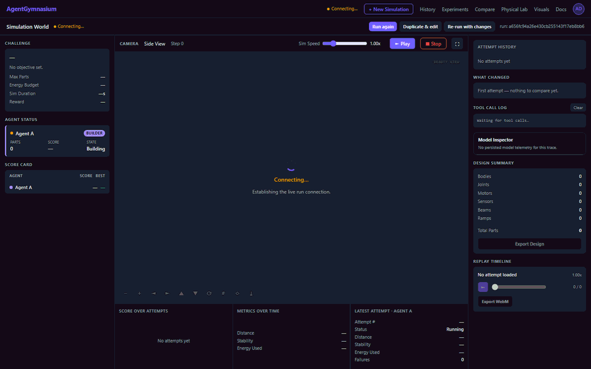

<div align="center">

# Agentarium

**A visual physics sandbox where LLM agents build bridges, creatures, and machines, watch the replay, and try again.**

[](https://github.com/oney-erge/Agentarium/actions/workflows/ci.yml)
[](LICENSE)
[](pyproject.toml)



<sub>Studio replaying the built-in offline demo run. The `mock` provider issues scripted tool calls, so this needs no API key and no model.</sub>

</div>

Give an agent a challenge, a world, a physics engine, and a set of explicit
tools. The agent builds creatures, bridges, machines, or tiny environments; the
backend validates and simulates the result; the Studio replays what happened;
and the run is scored with explainable metrics.

```text
Setup → tools → design → simulation → replay → score → next attempt
```

## Quick start

```bash
git clone https://github.com/oney-erge/Agentarium.git
cd Agentarium
./run.sh            # Linux. macOS: ./run.command   Windows: .\run.bat
```

The launcher installs [`uv`](https://docs.astral.sh/uv/) if needed (which
manages Python for you), installs dependencies, and opens Agentarium at
**http://localhost:8765**. A prebuilt web UI ships with the repo, so **Node is
not required**. The first run downloads dependencies and takes a minute or two;
after that it starts in seconds. Press `Ctrl+C` to stop.

No API key is needed to look around: the offline `mock` provider runs the whole
loop with scripted tool calls. To let a real model drive, point Agentarium at
[LocalDeploy](https://github.com/oney-erge/LocalDeploy) or any OpenAI-compatible
endpoint (see [OpenAI API key](#openai-api-key)).

## Why Agentarium

- **Agents act only through validated tools.** 24 explicit tools, and every
  design mutation goes through one chokepoint, so a bad tool call cannot crash
  the physics engine.
- **Every attempt is replayable.** Scrub the construction timeline and the
  physics timeline, and compare two to four replays side by side.
- **Runs are reproducible.** Provider, model, seed, benchmark fingerprint, token
  usage, latency, and prompts are recorded per turn, and paired
  model × seed × repeat experiments report mean/SD, confidence intervals, and
  win/tie/loss deltas.
- **It runs offline.** The `mock` provider needs no network, and the 2D physics
  engine (Pymunk) runs on the CPU, so no GPU is involved.
- **It reaches toward real robots, carefully.** Physical Lab uses the same typed
  observation/action boundary against a mock rover or a ROS 2 gateway. It is not
  a certified safety controller.

*Not to be confused with [Thytu/Agentarium](https://github.com/Thytu/Agentarium),
a different project: a Python framework for simulations populated by AI agents.*

<details>
<summary>Launcher details and the manual route</summary>

Every launcher accepts the same actions: `doctor`, `repair`, `docker`, `logs`,
and `stop`. Docker binds the UI to loopback and persists run data in a named
volume. You can double-click `run.bat` on Windows or `run.command` on macOS, and
use `.\run.ps1` to stay in PowerShell.

Setup checks disk space, serializes concurrent installs, and retries temporary
network failures up to three times. If it cannot finish, see
`.setup/install.log` for the persistent failure record.

To run things yourself:

```bash
uv sync --all-groups                 # install Python + deps
uv run agentarium serve --open       # start the server, open the browser
```

To rebuild the web UI (only needed if you change the frontend; requires Node
20.19+ or 22.12+):

```bash
cd frontend && npm install && npm run build
```

`make run`, `make serve`, `make ui`, `make test`, and `make lint` wrap the same
commands.

</details>

## What you get

Seven connected workspaces:

1. **Simulation Setup** — choose a task, world, agent protocol, models, tools,
   real resource constraints, and artifact outputs.
2. **Simulation Studio** — inspect the model turns and tool calls, scrub the
   construction and physics timelines, replay attempts, and export evidence.
3. **History** — reopen durable SQLite-backed runs, filter them, and select
   traces for comparison.
4. **Experiments** — run paired model × seed × repeat matrices with mean/SD,
   confidence intervals, and paired win/tie/loss score deltas.
5. **Compare** — synchronize two to four replays while comparing scores, config,
   tokens, latency, and native-tool versus prompt-JSON protocol.
6. **Physical Lab** — run the same typed observation/action boundary against a
   deterministic mock rover or a configured ROS 2 gateway, with explicit
   arming, geofences, limits, a watchdog, and a latched emergency stop.
7. **Visual Catalog** — review deterministic City/Bridge/Crawl/Sorter reference
   scenes across diorama, playful, blueprint, and neon themes. Studio replays
   can switch between a clean Beauty view and joint/velocity/ID-rich
   Engineering overlays.

A run is real and visible end to end: **Launch → agent builds via validated tool
calls → physics runs → the world replays it → scores and telemetry stream live.**

## Challenges

| Challenge | Reward | World | Goal |
| --- | --- | --- | --- |
| Bridge Builder | `bridge_transport` | Island Cliff | Carry the crate to the goal zone, stay standing, stay lean. |
| Crawl Challenge | `crawl_locomotion` | Hill Path | Move a creature forward and cross the threshold line. |
| Sorter | `sorting_accuracy` | Sorting Table | Drop each ball into the bin that **accepts its class** (color). |
| Tiny City | `city_score` | Tiny City Block | Lay out a well-spaced, livable little city. |

Each challenge scores differently: Bridge rewards goal progress + reaching the
goal, stability, and a lean part count; Crawl rewards pure forward locomotion and
crossing the line; Sorter does true object-class-to-bin matching (falling back to
plain containment when no class is declared); Tiny City rewards structure count,
spread, and nearest-neighbour spacing (livability).

## How it works

- **24 explicit tools** in five categories (build, sensors/control,
  physics/materials, simulation/inspection, evolution). Every design mutation
  goes through one validated chokepoint — agents can't crash the engine.
- **Engine-neutral traces.** The renderer consumes only an `EpisodeTrace`, so the
  physics engine is swappable (Pymunk2D now, PyBullet3D later).
- **Durable build timelines.** Each agent attempt persists labelled construction
  snapshots beside the physics trace, so historical Studio replay can show both
  what the agent built step by step and what happened in simulation.
- **Explainable scoring.** Named, pluggable reward functions turn trace metrics
  into a scorecard with a summary and a concrete improvement hint.
- **Iterative model loop.** Real providers can request a bounded preview,
  inspect score/state/failures, and revise within an attempt. Native function
  calls are used when supported, with validated JSON fallback.
- **Reproducible evaluation.** Provider/model/seed, benchmark fingerprint,
  protocol, token usage, retry count, request id, latency, prompts, and model
  results are recorded per turn.
- **Multi-agent.** `single`, `competitive`, `cooperative`, `relay`, and
  `sandbox` protocols, with lineage and every part attributed to its author.
- **LLM providers.** `mock` (offline, deterministic), `localdeploy`, and any
  OpenAI-compatible endpoint. Connection probes are short; generation calls have
  configurable timeouts and retry/backoff, and surface structured errors
  (auth / rate-limit / server / timeout / malformed). Tune via env vars:
  `AGENTARIUM_LLM_TIMEOUT_S` (default 120), `AGENTARIUM_LLM_RETRIES` (default 2),
  `AGENTARIUM_LLM_BACKOFF_S` (default 0.5).

### Headless runs and sweeps

The UI and automation use the same schemas and run pipeline:

```bash
uv run agentarium run --config path/to/launch.yaml --seed 42
uv run agentarium sweep --matrix path/to/experiment.yaml
```

Both commands print machine-readable JSON. Sweep cells remain ordinary durable
runs, so their replays open in Studio.

### Physical / ROS 2 gateway

Physical Lab always includes an offline mock rover. A real robot-side gateway
can be registered without adding ROS dependencies to the Agentarium server:

```bash
AGENTARIUM_ROS2_GATEWAY_URL=http://robot-gateway:8080
AGENTARIUM_ROS2_GATEWAY_TOKEN=robot-side-secret
AGENTARIUM_OPERATOR_KEY=human-arming-secret
uv run agentarium serve
```

Real-device arming also requires the operator key in the UI. Agentarium only
sends bounded `drive_to` and `stop` actions; the robot-side gateway must enforce
its own local watchdog, actuator limits, collision avoidance, and physical
emergency stop. **Agentarium is not a certified safety controller.** See
[`docs/EMBODIMENT.md`](docs/EMBODIMENT.md).

### OpenAI API key

For OpenAI-compatible hosted models, put your key in a repo-root `.env` file:

```bash
OPENAI_API_KEY=sk-...
```

The backend loads that file automatically. The Setup screen shows a masked
preview such as `sk-********1234`, uses the env key when the API-key field is
blank, and does not save the real key into `runs/workspace_config.json`.

See [`docs/ARCHITECTURE.md`](docs/ARCHITECTURE.md) for the full component map,
data-flow diagram, and invariants — and
[`docs/EXPERIMENTS.md`](docs/EXPERIMENTS.md) for reproducible model evaluation,
[`docs/EMBODIMENT.md`](docs/EMBODIMENT.md) for the physical boundary, and
[`docs/examples/`](docs/examples/) for a real generated
[run report](docs/examples/sample_report.md) and
[scorecard](docs/examples/sample_scorecard.json).

## Development

```bash
uv run ruff check .            # lint
uv run pytest                  # backend tests
cd frontend && npm run build   # type-check + build the UI; Node 20.19+ or 22.12+
npm --prefix frontend run lint # frontend lint

# Browser UI diagnosis — drives the Studio and Setup screens in headless Chromium
uv run python -m playwright install chromium   # one-time browser download
AGENTARIUM_VISUAL_TESTS=1 uv run pytest backend/tests/test_visual_playwright.py

# Optional live OpenAI smoke checks (normal tests stay offline)
AGENTARIUM_LIVE_OPENAI_TESTS=1 uv run pytest backend/tests/test_openai_live_smoke.py
```

CI runs lint + tests + the frontend build on every push and PR. Backend changes
must keep all three gates green and ship with tests (use the `mock` provider so
tests need no network). Playwright lets you smoke-test the side-view renderer,
tool-call log, and scorecard against a live local server — UI tests skip cleanly
if its browser isn't installed. Conventions and architecture invariants live in
[`CLAUDE.md`](CLAUDE.md).

## Documentation

Current docs:

- [`docs/ARCHITECTURE.md`](docs/ARCHITECTURE.md) — implemented architecture,
  contracts, tools, scoring, modes, and invariants.
- [`docs/EXPERIMENTS.md`](docs/EXPERIMENTS.md) — model matrices, paired seeds,
  statistics, CLI automation, and artifacts.
- [`docs/EMBODIMENT.md`](docs/EMBODIMENT.md) — mock/ROS 2 adapters, physical
  episodes, safety state machine, and gateway contract.
- [`docs/remaining_gaps.md`](docs/remaining_gaps.md) — current backlog of known
  gaps and deferred work.
- [`docs/IMPROVEMENTS.md`](docs/IMPROVEMENTS.md) — review notes, shipped
  improvements, and larger roadmap items.
- [`docs/examples/`](docs/examples/) — sample exported report and scorecard.

Historical planning docs:

- [`docs/archive/`](docs/archive/) captures the original product plan, build
  sequence, and early gap analysis. Treat these as background unless you are
  auditing how the MVP got here.
